# RotaOnco — Arquitetura Alvo

## Visão Geral
- Plataforma distribuída composta por aplicações Web (TanStack Router + React) e Mobile (Expo + React Native + NativeWind) consumindo APIs Hono executadas sobre Bun.
- Persistência centralizada em MySQL operacionalizada via Drizzle ORM e gerenciada por migrations versionadas.
- Autenticação e autorização providas por Better Auth com RBAC (paciente, profissional, administrador) e proteção contra abuso (rate limiting, bloqueio após três tentativas).
- Camada de integração para notificações assíncronas (WhatsApp prioritário, SMS fallback) desacoplada via adapters, permitindo troca futura de provedores.
- Observabilidade com logs estruturados, métricas e trilhas de auditoria para operações críticas.

## Diretrizes de Arquitetura e Trade-offs
- **Single database, múltiplos clientes**: favorece consistência dos dados e simplifica relatórios, à custa de exigir controles rígidos de RBAC.
- **Hono + Bun**: serverless-friendly e leve para APIs de baixa latência; exige disciplina para bibliotecas compatíveis com o runtime.
- **Better Auth**: acelera a implementação de fluxos de login com MFA/PIN e RBAC, porém demanda integração cuidadosa com políticas de bloqueio.
- **Jobs assíncronos para lembretes**: garante SLA de envio sem bloquear requisições interativas; introduz complexidade operacional (fila ou scheduler).
- **Expo + NativeWind**: aumenta produtividade no mobile com hot reload e design consistente, mas requer atenção às limitações de performance em dispositivos modestos.
- **TanStack Router**: fornece roteamento e loaders declarativos, simplificando data fetching e estados, porém exige tipagem rigorosa para manter coesão.

## Diagrama de Contexto
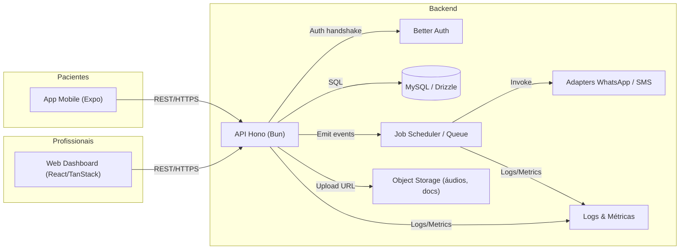

## Componentes Principais
- **apps/web**: SPA protegida por RBAC com layouts exclusivos para profissionais e administradores; consome cliente gerado a partir do OpenAPI.
- **apps/native**: App mobile em Expo com fluxos de paciente e profissional, armazenamento seguro de PIN/token e suporte a áudio.
- **apps/server (API)**: Hono + Bun com middlewares (auth Better Auth, rate limiting, auditoria, validação com Zod) e camadas (routes → controllers → services → repositories).
- **packages/shared**: tipos TypeScript compartilhados, cliente OpenAPI e utilitários (formatadores, regras de negócio reutilizáveis).
- **Infraestrutura**: Docker Compose para MySQL local, scripts de seeds (Drizzle), pipelines de CI/CD (.github/workflows), configuração de observabilidade.
- **Notificações**: módulo agnóstico de provedores com abstração `NotificationService`, adapters `WhatsAppAdapter` e `SmsAdapter`, e fila `notification_jobs`.

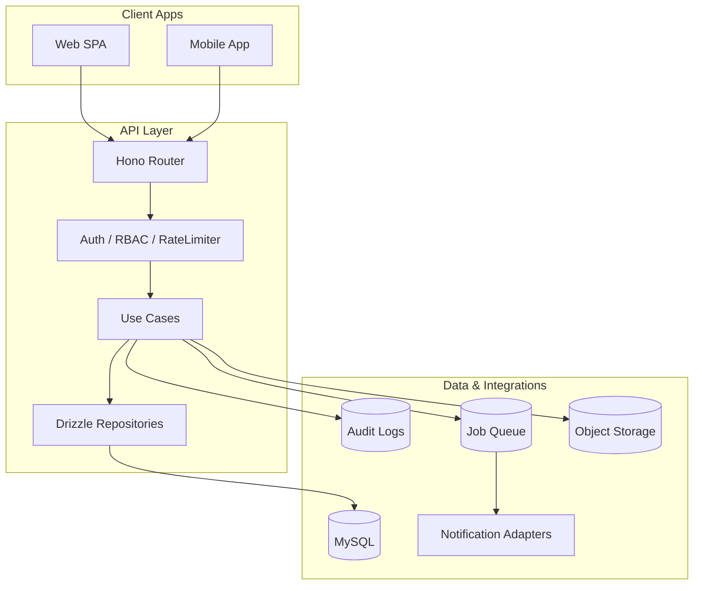

## Topologia por Ambiente
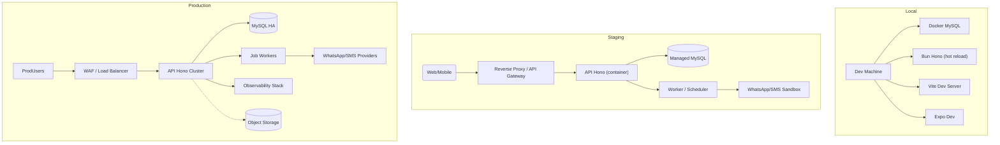

- **Local**: foco em produtividade (hot reload), dados artificiais e seeds mínimos.
- **Staging**: ambiente espelho com autenticação real e integrações em modo sandbox; usado para QA/UAT.
- **Produção**: múltiplas réplicas da API atrás de balanceador, MySQL em alta disponibilidade, workers horizontais e observabilidade centralizada.

## Sequências Principais
### Cadastro de Profissional
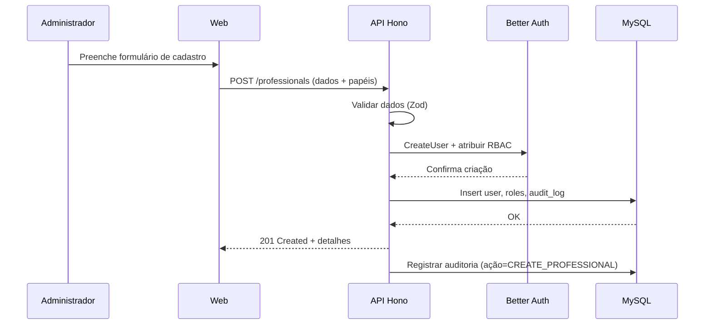

### Login Profissional
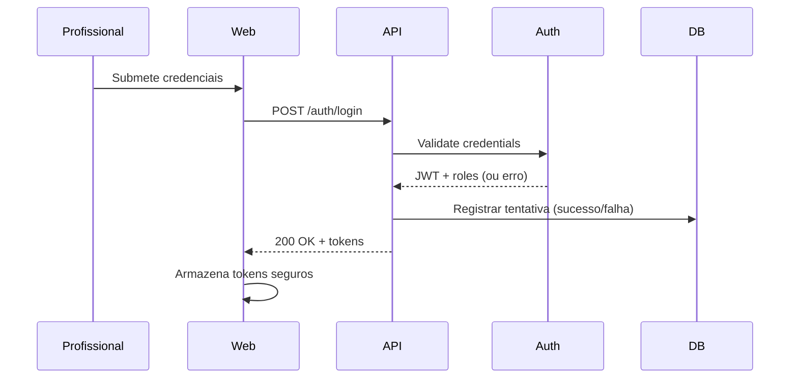

### Login Paciente via PIN
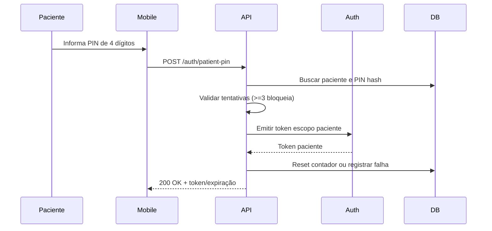

### Agendar Consulta
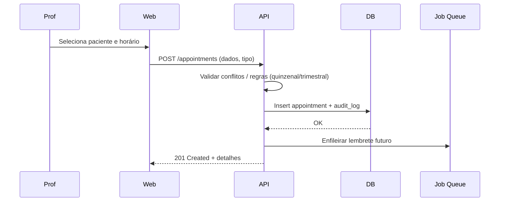

### Confirmação de Presença
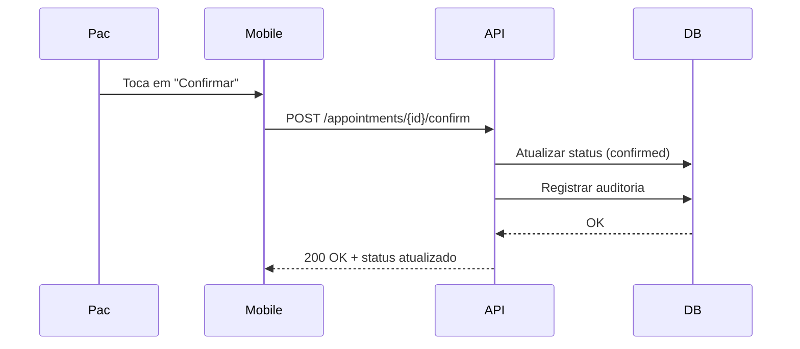

### Registro de Intercorrência
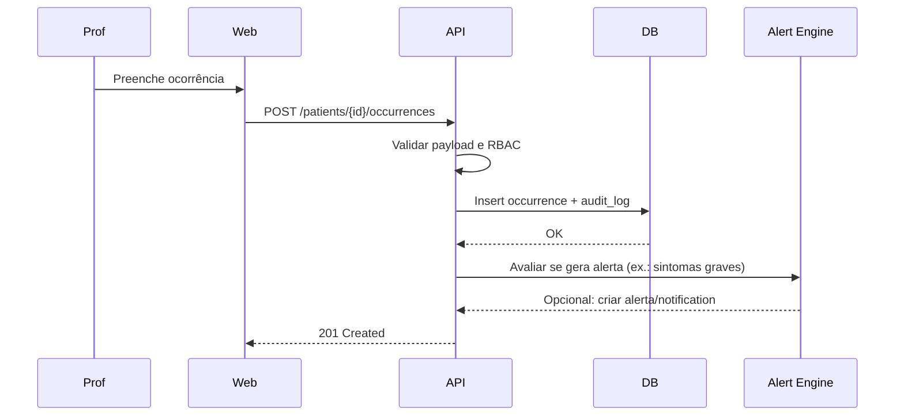

### Lembrete Automático
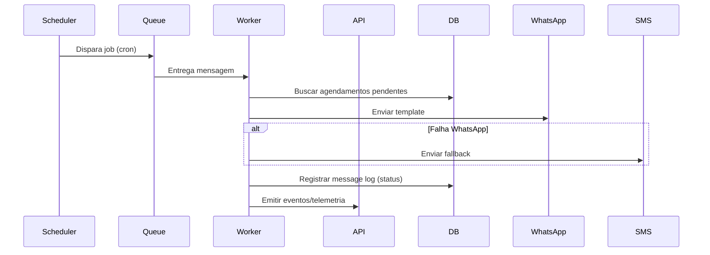

### Geração de Relatório
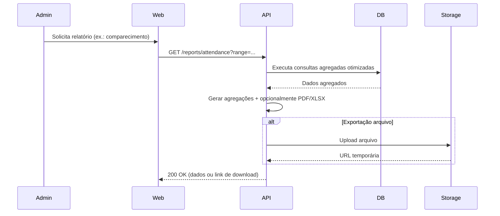

## Segurança e Compliance
- **Autenticação**: Better Auth (profissionais/administradores via login, pacientes via PIN), tokens curtos + refresh, armazenamento seguro (SecureStore / HttpOnly).
- **Autorização**: middleware RBAC centralizado; negação por padrão e checagem granular por rota.
- **Proteções**: rate limiting em auth/ações críticas, bloqueio após três tentativas falhas, validação de CPF único, auditoria para CRUD sensíveis.
- **LGPD**: categorização de PII (CPF, dados clínicos); logs com mínimos necessários; segregação de dados por perfil.

## Observabilidade e Operação
- **Logging**: Pino (ou semelhante) estruturado com correlação de requisições e jobs.
- **Métricas**: coletas de latência, throughput, taxa de erro, fila de lembretes e bloqueios de login.
- **Tracing**: opcional (OpenTelemetry) para fluxos críticos.
- **Alerting**: thresholds em latência (>3s), erro (>5%), congestionamento de fila, falhas consecutivas de envio de mensagens.

## Próximos Passos
1. Refinar modelo de dados com base nas decisões (PR-03) e gerar ERD + migrations.
2. Detalhar integração com provedores de notificações quando decisão for tomada.
3. Planejar infraestrutura de observabilidade (stack ELK/OTel) e CI/CD.
